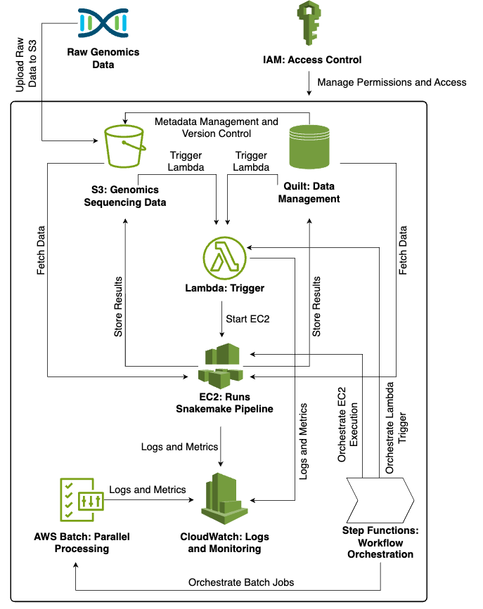

# Genomic Sequencing Migration Pipeline

This repository contains a bioinformatics pipeline designed to process simulated genomic sequencing data. The pipeline automates the processing of FASTQ files and manages the data using a cloud infrastructure. It is optimized for scalability and efficiency, reducing the need for manual intervention.

## Table of Contents
- [Introduction](#introduction)
- [Installation](#installation)
- [Pipeline Overview](#pipeline-overview)
- [Input Data](#input-data)
- [Usage](#usage)
- [Outputs](#outputs)
- [AWS Architecture](#aws-architecture)
- [Cost Estimate](#cost-estimate)
- [Development and Testing Environment](#development-and-testing-environment)
- [Contributing](#contributing)
- [License](#license)

## Introduction
This pipeline automates the migration and processing of simulated genomic sequencing data, providing robust and scalable solutions for handling large datasets. It is built using Snakemake and designed to run on AWS infrastructure, leveraging cloud services to optimize performance and reduce processing time.

## Installation

### Dependencies

To run this project, you will need the following dependencies installed:

- **Conda**: An environment manager to handle package installation and dependency management.
- **AWS CLI**: Command-line tool for interacting with Amazon Web Services.

### Installation Instructions

You can install all the required dependencies by following these steps:

1. Ensure you have Conda installed. If not, you can download it from [here](https://docs.conda.io/en/latest/miniconda.html).

2. Clone the repository and navigate to the project directory:

    ```bash
    git clone https://github.com/emanuelmfonseca/sequencing-migration.git
    cd sequencing-migration
    ```

3. Create and activate the Conda environment using the provided `environment.yml` file:

    ```bash
    conda env create -f envs/environment.yml
    conda activate sequencing-migration
    ```

This will automatically install **Snakemake** and any other necessary packages specified in the environment configuration. **Snakemake** is a powerful workflow management system designed to create reproducible, scalable, and automated data analysis pipelines.

4. Install the AWS CLI if it's not included in your Conda environment:

    ```bash
    conda install -c conda-forge awscli
    ```

### Setup AWS Credentials
Configure your AWS credentials for S3 access:

```bash
aws configure
```

## Pipeline Overview
The pipeline processes simulated sequencing data by performing primary and secondary analysis stages, including demultiplexing, alignment, and variant calling.

1. ### Primary Analysis

The primary analysis focuses on the initial steps of preparing the data. This phase is crucial because it ensures that we generate high-quality datasets, including trimmed reads and assessments for adapter sequences. By establishing these initial steps, we improve the quality of the subsequent analysis.

- **Generate SNP Matrices**
    - The first step involves running a demographic simulation script to create SNP matrices for multiple weekly runs. This simulates genetic variation based on input demographic parameters.

- **Generate Genomes**
    - In this stage, reference and individual genomes are generated from the SNP matrices. This involves using another simulation script to produce FASTA files for each weekly run, creating both reference genomes and individual genomes for the specified number of samples.

- **Concatenate Individual Genomes**
    - Individual genome FASTA files are concatenated into multi-FASTA files for each weekly run. This prepares the data for generating reads in the next step.

- **Simulate Reads**
-    The multi-FASTA genomes are used to generate simulated FASTQ files (R1 and R2) using the InSilicoSeq tool. This step simulates sequencing reads for the genome.

- **Quality Assessment of Raw Reads**
    - FastQC reports are generated for the simulated FASTQ files to assess the quality of the sequencing data.

- **Trimming Reads**
    - Trimmomatic is utilized to trim the raw FASTQ files to remove low-quality bases and adapter sequences, producing cleaned FASTQ files.

- **Quality Assessment of Trimmed Reads**
    - FastQC reports are generated again for the trimmed reads to evaluate the quality after trimming.

- **Demultiplexing**
    - The trimmed FASTQ files are demultiplexed into sample-specific files based on predefined patterns, allowing for separate analysis of each sample's reads.


2. ### Secondary Analysis

The secondary analysis begins with indexing the reference genome, which organizes it for efficient access. This allows individual sample reads to be mapped to the reference genome, aligning their sequences accurately. Once the reads are aligned, genetic variants can be identified by comparing the sample data to the reference, enabling detailed analysis of genetic differences within the dataset.

- **Index Reference Genome**
    - The reference genome is indexed using BWA to prepare for alignment. This step includes generating necessary auxiliary files (like the FASTA index and sequence dictionary).

- **Align Reads**
    - The demultiplexed FASTQ files are aligned to the reference genome using BWA. The results are stored in SAM and BAM formats, with sorting and duplicate marking performed for each sample.

- **Variant Calling**
    - GATK's HaplotypeCaller is used for variant calling on the aligned BAM files, producing GVCF files for each sample.

- **Combine GVCFs and Genotype**
    - GVCF files from all samples are combined, and GATK's GenotypeGVCFs is run for final variant calling, resulting in a comprehensive VCF file for the weekly run.

## Usage

### Input Data
The input data for this pipeline is automatically generated from simulations of genomic sequencing processes, eliminating the need for external input. However, modifying the configuration file is necessary, particularly to update the working directory.

**Edit Configuration File**: Modify the `config.yaml` file to define the necessary paths and key parameters:

   #### Main Parameters
      - working_directory: Specify the full path to the working directory for your project
      - weekly_runs: Number of independent genomic runs to perform
      - nsamples: Number of individuals (samples) processed in each run
      - ncpus: Number of available CPU cores for parallel processing

**Run the Pipeline**:
   To execute the pipeline, run the following command:

```bash
snakemake --cores <number_of_cores>
```

   **Example**:
      If running with 4 cores, use:

```bash
snakemake --cores 4
```

### Outputs

- The pipeline generates various outputs at each stage, including:

  - **SNP matrix**: A matrix of single nucleotide polymorphisms for each sample, used for population genetic analyses.
    - Example: `data/demographic-simulations/snp-matrix_1.txt`.

  - **Reference genome**: The reference genome used for alignment and variant calling.
    - Example: `data/genome-simulations/genomes_1/fasta/reference_genome_1.fasta`.

  - **Quality reports**: FastQC HTML files for raw and trimmed reads.
    - Example: `data/genome-simulations/genomes_1/qc/genome_1_R1_fastqc.html`.
  
  - **Trimmed FASTQ files**: FASTQ files after trimming.
    - Example: `data/genome-simulations/genomes_1/fastq_trimmed/genome_1_R1_trimmed.fastq`.

  - **Demultiplexed FASTQ files**: FASTQ files split by sample.
    - Example: `data/genome-simulations/genomes_1/demultiplexed/sample_1/genome_1_Ind1_R1_demultiplexed.fastq`.

  - **Aligned SAM and BAM files**: Aligned sequence data and associated metrics.
    - Example: `data/genome-simulations/genomes_1/demultiplexed/sample_1/dedup_sorted_aligned_genome_1.bam`.

  - **Index files**: Index files for efficient BAM file access.
    - Example: `data/genome-simulations/genomes_1/demultiplexed/sample_1/dedup_sorted_aligned_genome_1.bam.bai`.

  - **Variant call files (VCFs)**: Individual and combined VCFs.
    - Example: `data/fully-processed-data/genomes_fully_processed_run_1.vcf`.

## AWS Architecture

### **Genomic Data Processing Pipeline Using AWS with IAM Integration**:

This genomic pipeline is designed to automate sequencing data processing using various AWS services, ensuring scalability, automation, and secure access management using **IAM**. The workflow involves data ingestion, processing, and storage, managed entirely through AWS infrastructure.

#### **1. Data Ingestion into S3**:
- Sequencing data is uploaded to an **S3 bucket**. This bucket serves as the central storage location for raw sequencing data (e.g., FASTQ files), intermediate results, and final outputs.
- **IAM roles** are assigned to ensure that only authorized services and users have the ability to read and write data to the S3 bucket.
- Every time new data is uploaded, an event is triggered within AWS to start the pipeline.

#### **2. Lambda Trigger**:
- **AWS Lambda** is automatically triggered when new data is uploaded to the **S3 bucket**. Lambda functions have an **IAM role** attached to them, which grants them the permission to read from S3, execute workflows, and interact with other services (like EC2 or AWS Batch).
- This ensures secure automation of the pipeline whenever new data becomes available.

#### **3. Running the Snakemake Pipeline on EC2**:
- The **Lambda function**, using its **IAM role**, starts an **EC2 instance** to execute the Snakemake pipeline. The EC2 instance also has an **IAM role** attached to it that allows it to interact with other AWS services, such as pulling raw data from **S3** and sending logs to **CloudWatch**.
- The Snakemake pipeline running on EC2 downloads the raw data from the S3 bucket and processes it (e.g., quality control, alignment, variant calling).

#### **4. Storing Outputs in S3**:
- After processing, the output files (e.g., BAM, VCF files) are uploaded back to the **S3 bucket**. The **EC2 instance**, with the permissions granted by its **IAM role**, ensures that it can store the results securely in the S3 bucket.
- This ensures centralized, secure storage of both raw and processed data.

#### **5. Batch Processing**:
- For large-scale data or parallel workflows, the pipeline can use **AWS Batch**. Here, Lambda submits jobs to AWS Batch, which provisions EC2 instances to run the jobs.
- **IAM roles** attached to AWS Batch instances ensure that jobs have access to the required S3 data and permissions to execute the Snakemake pipeline securely.

#### **6. Workflow Orchestration with Step Functions**:
- **AWS Step Functions** orchestrate the various stages of the pipeline, ensuring tasks such as data fetching, processing, and storing occur in sequence.
- **IAM roles** allow Step Functions to interact with Lambda, EC2, and other services, ensuring secure execution of each step in the pipeline.

#### **7. Monitoring and Logging with CloudWatch**:
- All logs from EC2, Lambda, and Batch are sent to **CloudWatch** for real-time monitoring.
- The **IAM roles** attached to each of these services allow them to securely send logs and metrics to **CloudWatch**, providing detailed insights and troubleshooting capabilities.

#### **8. Secure Access with IAM**:
- **IAM roles** control access between services, ensuring that each service (Lambda, EC2, Batch) has only the permissions it needs to interact with other AWS resources, ensuring security and minimizing risks.
- IAM roles assigned to the various AWS services (S3, Lambda, EC2, Step Functions, CloudWatch) ensure secure and managed access to resources.

#### **Data Flow Summary with IAM**:
1. **S3 → Lambda**: New data uploaded to S3 triggers Lambda, with an **IAM role** granting it access to S3.
2. **Lambda → EC2**: Lambda starts an EC2 instance, and **IAM roles** on EC2 allow it to fetch data from S3 and run the Snakemake pipeline.
3. **EC2 → S3**: EC2, using its **IAM role**, stores processed results back in S3.
4. **EC2 → CloudWatch**: EC2 sends logs to CloudWatch using **IAM permissions**.
5. **Optional**: **AWS Batch** uses **IAM roles** to securely manage job scheduling for parallel processing.
6. **Step Functions → Lambda/EC2**: Step Functions securely orchestrate the workflow using **IAM roles** to manage permissions.

An architecture diagram and detailed explanation can be found in the figure below .

## Cost Estimate
A cost estimate for running the pipeline on AWS has been calculated using the AWS Pricing Calculator. This includes:
- EC2 instances for processing
- S3 for data storage
- AWS Batch for workflow orchestration

Details can be found in the `cost_estimate.txt` file.

## Development and Testing Environment
This pipeline was developed on a **MacBook 2020 with an M1 chip**. The tutorial associated with this project was tested on another machine with the same configuration.

## Contributing
Contributions are welcome. Please open an issue or submit a pull request for any improvements. For questions, feel free to email emanuelmfonseca@gmail.com.

## License
This project is licensed under the MIT License. See the `LICENSE` file for details.
